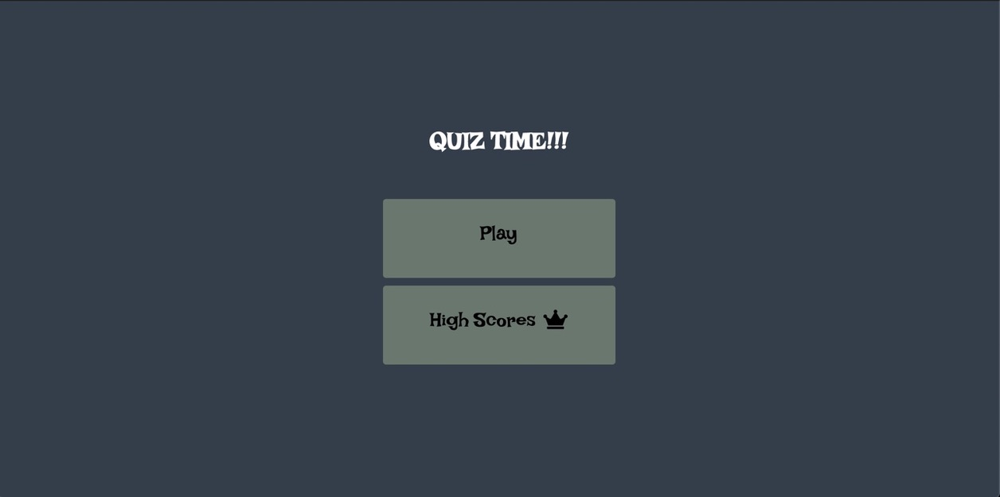

# Code_Quiz

Homework 4 Coding Quiz

For this weeks homework, we had to come up with a code quiz that included some pretty challenging questions(Not Really) from some of the JavaScript concepts that we have learned in this weeks course. It is multiple choice and includes a progress bar to track how many questions have been completed and at the end you can enter a name to save your score. 

